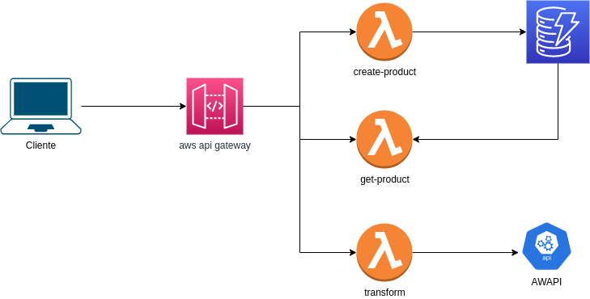

# node-worktest
Este proyecto cuenta con los siguientes servicios:
 * **transform**: Permite traducir modelos de la API
 * **create-product**: Permite crear productos
 * **get-product**: Permite obtener un producto

Utiliza una **DynamoDB** como base de datos y el modelo de datos utilizado es el siguiente:

  ```json
  {
    "id": "uuid",
    "name": "string",
    "reference": "string",
    "price": "number",
    "quantity": "number"
  }
  ```

La arquitectura utilizada es la siguiente:



## Dependencias
  * nodejs

## Despliegue

  * En la raíz del proyecto ejecutar el comando **npm install**
  * Ejecutar el comando **npm run deploy**
  